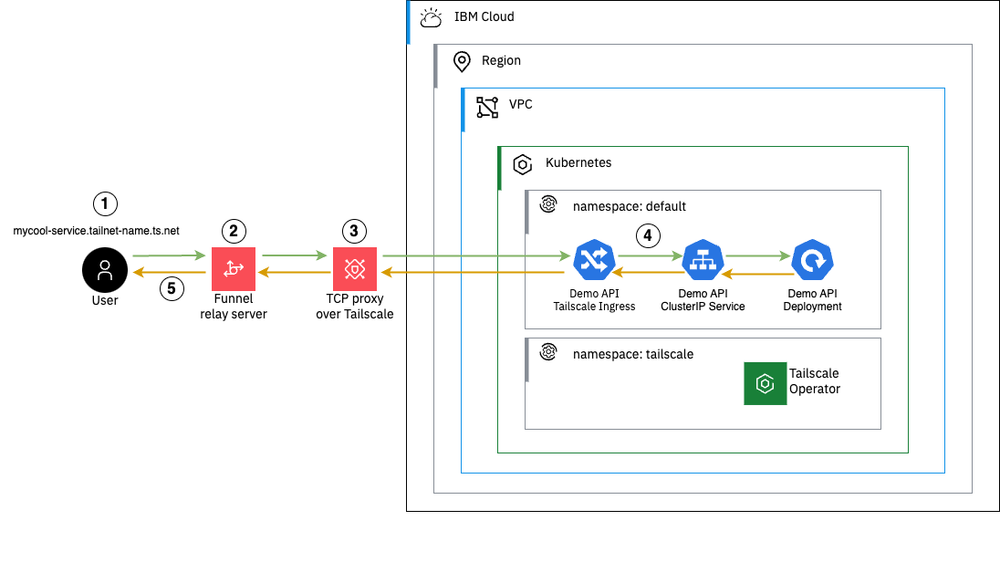

# Expose private-only IKS service to the internet using Tailscale

In this guide I will show you how to expose a private-only ClusterIP service running in Kubernetes to the public internet using the Tailscale Operator. 

---

